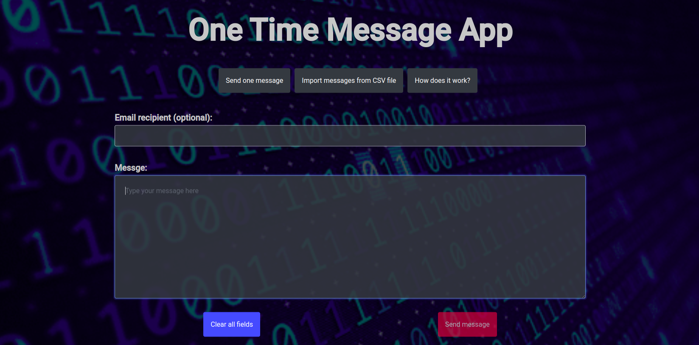
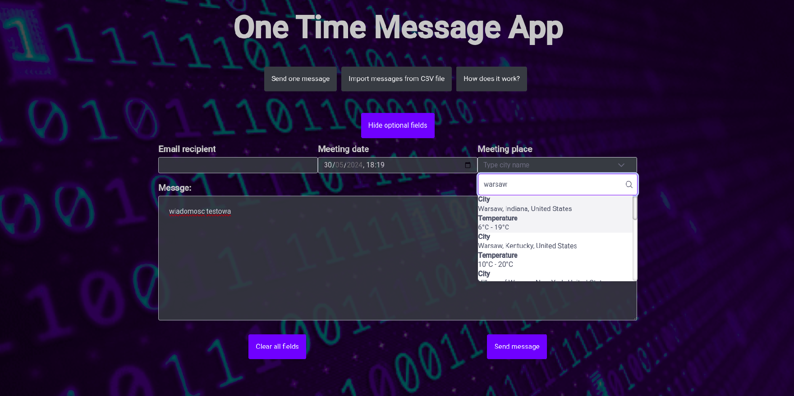
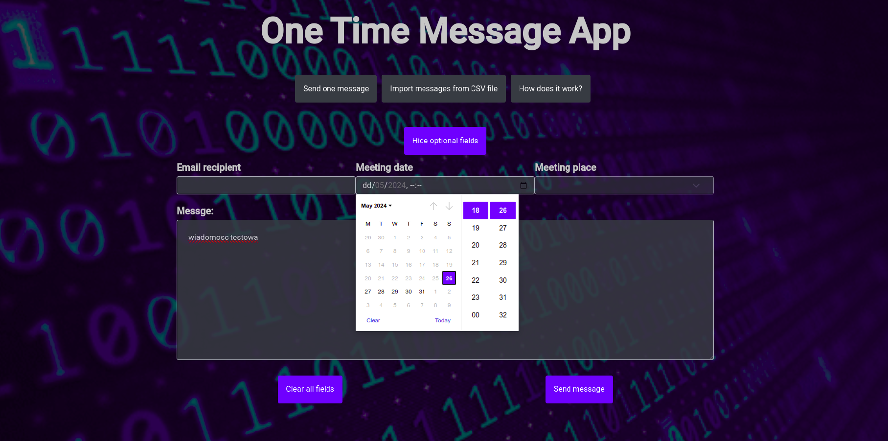
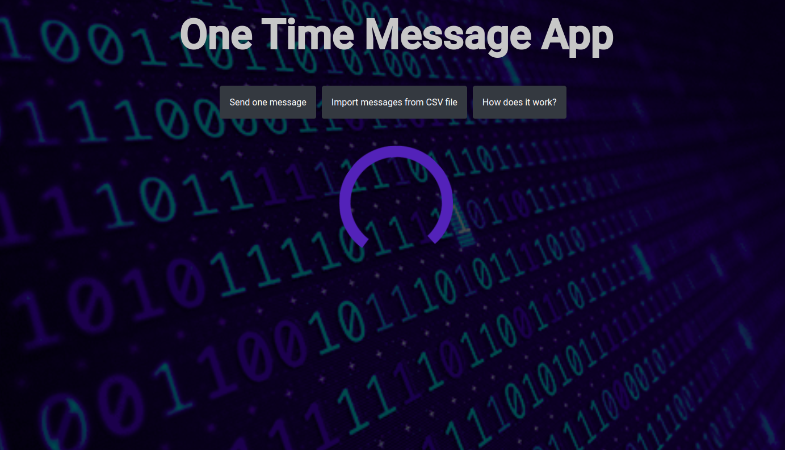
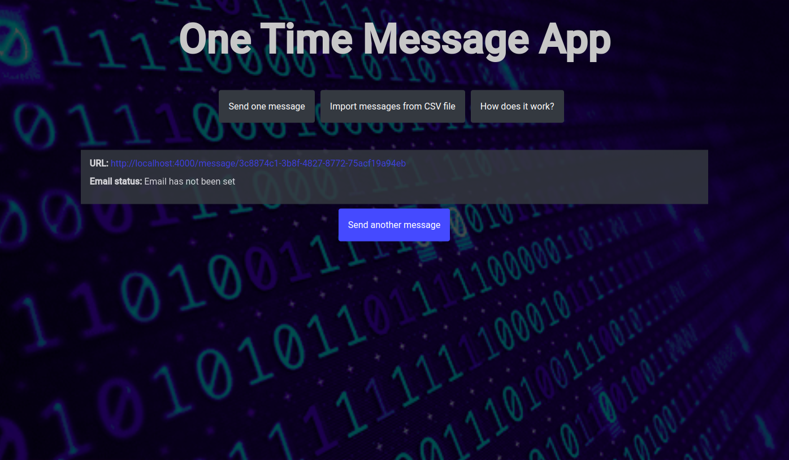
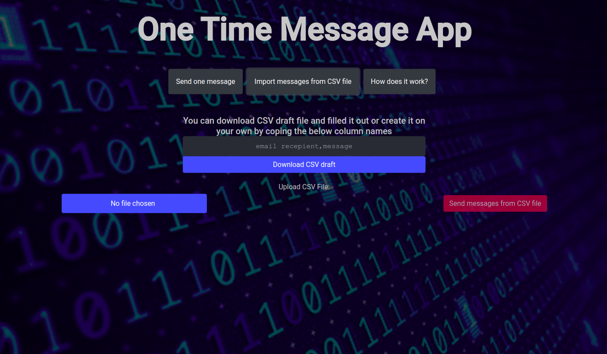
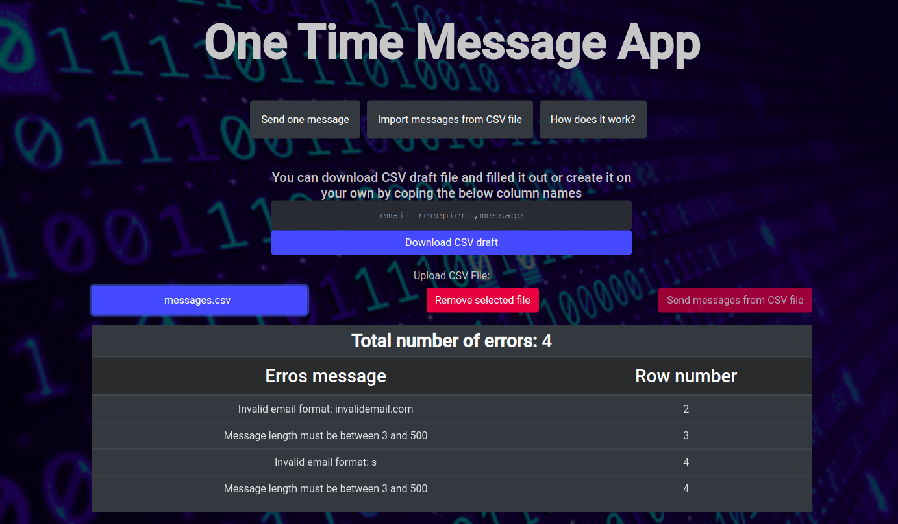
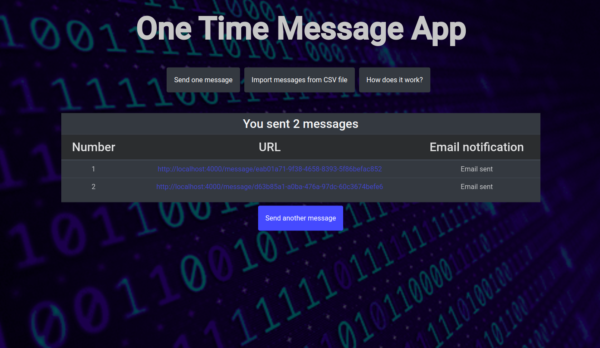
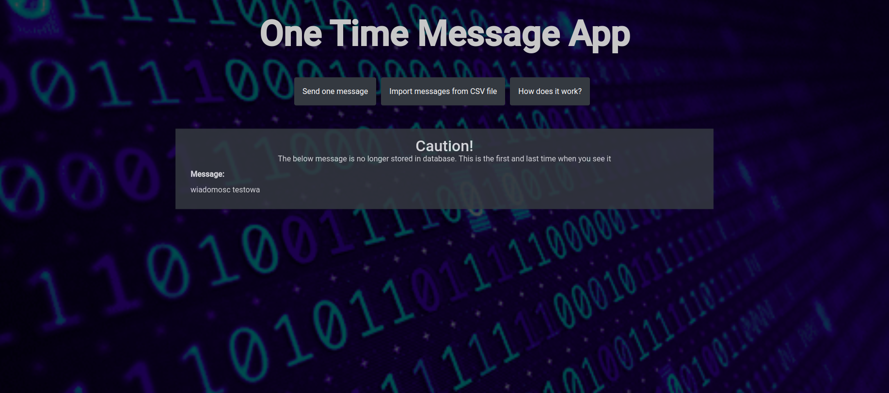

# FeOnetimemessage

- The idea for this application is to send a message to recipient that can be accessed only via unique URL and can be seen only once
- Email notofication is supported - if email will be submitted the recipient will receive an email with the unique URL. The application is integrated with external email service provider and the whole process is handled by separate thread on BE. 
- Upload messages from CSV file is supported - it is possible to create several messages and send them at once.

## Table of contents
* [Tech stack](#Tech-stack)
* [Single message](#Single-message)
  * [Selecting meeting date and place](#Selecting-meeting-date-and-place)
* [Uploading messages](#Uploading-messages)
* [Accessing message](#Accessing-message)
* Backeend repository https://github.com/jankee1/be-onetimemessage/

## Tech stack

| FE            | BE               |
|---------------|------------------|
| Angular 17    | Java 21          |
| Material UI   | Spring Boot 3.2  |
| Bootstrap     | PostgresSQL      |
| HTML + CSS    | Hibernate        |

# Single message
A user needs to fill in a form. Each field is validated.

## Selecting meeting date and place

If input is valid, the form can be submited. When client is awaiting for response a loader is displayed.

Once the message is created unique URL is shown. This is the URL that can be shared with the recipient.

# Uploading messages
A user needs to upload a valid CSV file with message. A draft of CSV can be downloaded or created by the user as guided on the screenshot. Custom method is implemented for validation of CSV file

If invalid CSV file will be uploaded - errors will be dislayed row by row
 
(example of file with invalid content)
| Email recepient  |  Message         |
|------------------|------------------|
| invalidemail.com | test             |
|                  | l                |
| s                | s                |

If file will be validated successfully - user will be shared unique URLs to messages and email status (if email was filled in)
 
(example of file with valid content)
| Email recepient  |  Message             |
|------------------|----------------------|
| valid1@email.com | csv widomosc testowa |
| valid2@email.com | csv widomosc testowa |

# Accessing message
When recipient will click on the shared link - he / she will be shown the message that was created by the author.

