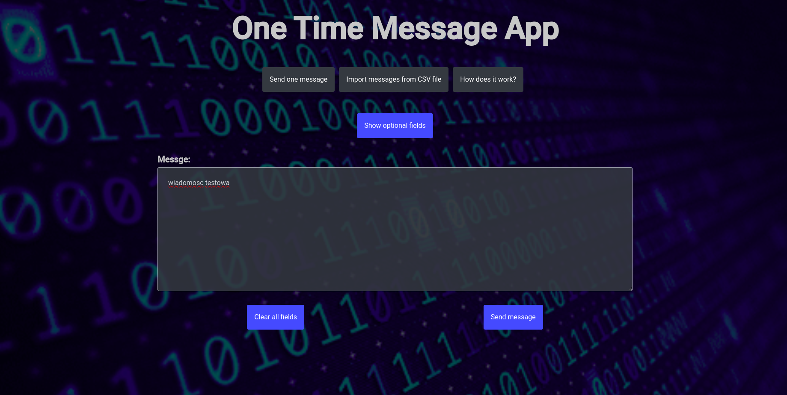
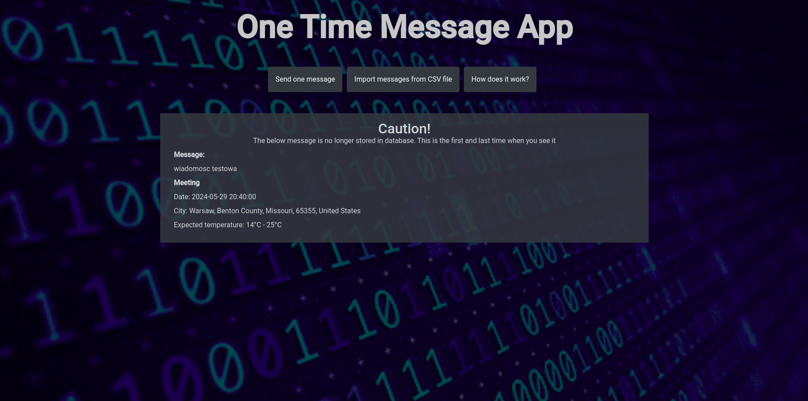

# FeOnetimemessage

- The idea for this application is to send a message to recipient that can be accessed only via unique URL and can be seen only once
- Email notofication is supported - if email will be submitted the recipient will receive an email with the unique URL. Email notifier is handled on separate thread on BE
- Upload messages from CSV file is supported - it is possible to create several messages and send them at once

## Sending single message

## Uploading messages from CSV file

